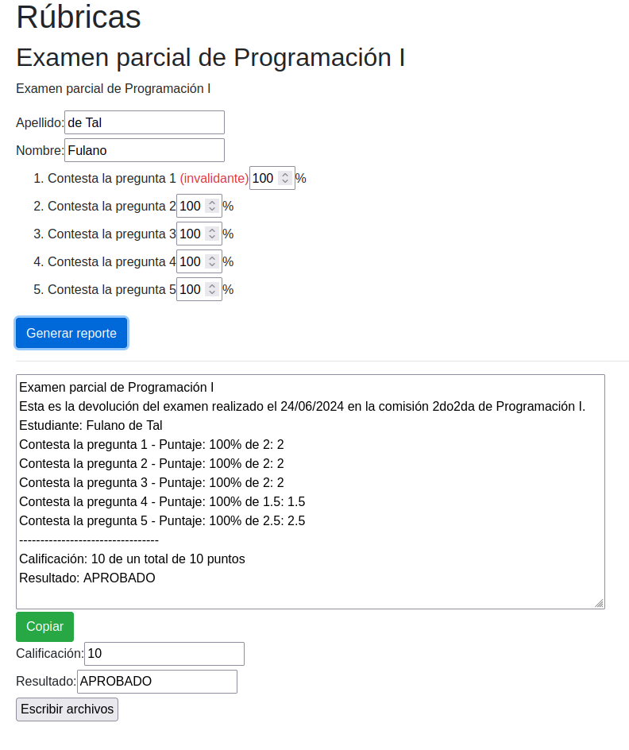

# rubricas
Rúbricas para evaluar examenes / TP. Selfhosted en PHP.

## Instalación

1. Clonar este repositorio, o descargar y descomprimir el archivo zip (desde el
botón verde que está arriba y dice "Code").
2. Escribir el archivo `config.php` con los items a evaluar y el puntaje de cada
uno. El mismo archivo tiene comentarios que indican cómo completarlo. Una vez
editado el archivo, guardar y salir.
3. Verificar que el archivo `config.php` no tenga errores. Para eso, desde una
terminal podemos ejecutar el comando `php -l config.php`.
4. Lanzar un servidor PHP desde la carpeta del proyecto. En sistemas GNU/Linux,
se puede lanzar desde una terminal con `php -S localhost:8765`, donde `8765`
podría ser cualquier otro puerto válido.
5. Con un navegador web, ingresar a http://localhost:8765 para comenzar a
evaluar.

## Captura de pantalla

## Pendiente

- Hacer una interfaz para armar la config desde la web, que genere un output
como JSON.
- Hacer que la rúbrica permita subir la config como json (¿guardarla como una
variable de sesión?).
- Una vez hechos los items anteriores, no hace falta que esté selfhosteado, se
puede hostear en algún lado.
- Agregar un input que permita dejar un comentario en cada item.
